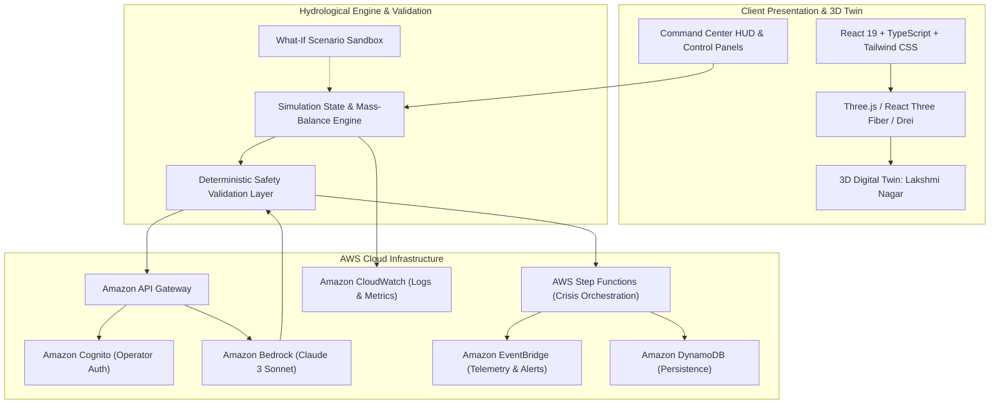

# JalSetu (जलसेतु)
### "From Water Crisis to Intelligent Response."

> **Track**: Heat & Water — Water scarcity, tanker management, leaks, floods, droughts, and water conservation.  
> **Type**: AI-Powered 3D Digital Twin & Autonomous Water Crisis Response System.  
> **Architecture**: React + TypeScript + Three.js / React Three Fiber + Tailwind CSS + Amazon Bedrock + AWS Step Functions + Amazon EventBridge + Amazon DynamoDB + Amazon Cognito.

---

## 🌊 Overview & Core Problem

Water crises in high-density urban and peri-urban Indian communities are dynamic, volatile, and unforgiving. When a main distribution trunk fails or a reservoir level falls past critical thresholds:
- Traditional SCADA systems only trigger visual alarms without operational guidance.
- Critical institutions like **hospitals (ICU, dialysis, sterilization)** and **schools** compete with high-volume residential demand.
- Municipal operators struggle to calculate optimal water diversion, tanker routing, and pressure rationing under severe time pressure.

### The JalSetu Solution
**JalSetu does not merely detect a water crisis. JalSetu decides what should happen next and visually demonstrates the response in an interactive 3D digital twin.**

1. **Live GPS Geolocation & Global Community Generation**: Anyone opening JalSetu can click **"USE MY LIVE LOCATION"** to fetch their exact device GPS coordinates via browser geolocation and reverse-geocode their locality (e.g., Delhi, Bengaluru, Mumbai, or international). JalSetu dynamically anchors the 3D twin, models their local ward, and centers Google Maps Satellite directly over their neighborhood!
2. **Interactive 3D Digital Twin**: Models the community with live cylindrical water reservoirs, hospital trauma center, schools, residential apartment clusters, pipeline networks with animated water flow particles, and emergency response tankers.
3. **Deterministic Simulation Engine**: Executes mass-balance hydrological formulas ensuring zero negative water, strict capacity bounds, and physical conservation laws.
4. **Amazon Bedrock Decision Core**: Synthesizes real-time telemetry into priority-ranked, validated emergency allocation plans.
5. **AWS Step Functions Orchestration**: Executes end-to-end multi-stage emergency response workflows (validation, priority ring-fencing, tanker dispatch, valve rationing, rainwater injection).
6. **What-If Contingency Sandbox**: Clones the live simulation state to model scenarios like *"What if the emergency tanker is delayed by 2 hours?"* without mutating the operational baseline.

---

## 🏛️ System Architecture



---

## ⚙️ AWS Services Integration

| AWS Service | Purpose in JalSetu |
|---|---|
| **Amazon Bedrock** | Formulates priority-ordered emergency water allocation plans using structured JSON reasoning based on live pressure, deficit, and facility risks. |
| **AWS Step Functions** | Coordinates the 8-stage state machine workflow: `INCIDENT` → `VALIDATE` → `PRIORITIZE` → `ALLOCATE` → `DISPATCH` → `CONSERVE` → `VERIFY` → `RESOLVED`. |
| **Amazon EventBridge** | Decoupled event bus emitting events (`WaterCrisisDetected`, `PipelineFailureDetected`, `TankerDispatched`, `CrisisResolved`). |
| **Amazon DynamoDB** | Stores community topology, telemetry snapshots, incident logs, and post-resolution audit records. |
| **Amazon Cognito** | Role-based operator authentication (`Water Operations Officer`). Zero AWS credentials stored in frontend code. |
| **Amazon CloudWatch** | Structured logging and custom metric tracking (WaterSecurityScore, ResponseTimeMs, ReservoirLevel). |
| **AWS Amplify** | Production hosting and continuous deployment pipeline. |

---

## 💧 Community Topology (Seed Data: Lakshmi Nagar)

- **Total Population**: 2,840
- **Central Water Tank**: 30,000 L capacity (Initial level: 18,000 L)
- **Hospital (Lakshmi Nagar General)**: Demand: 6,000 L • Priority: CRITICAL (Trauma / ICU)
- **School (Saraswati Vidya Mandir)**: Demand: 3,000 L • Priority: HIGH (520 students)
- **Residential Block A (North)**: Demand: 8,000 L • Population: 800
- **Residential Block B (Central)**: Demand: 7,000 L • Population: 1,200
- **Residential Block C (East)**: Demand: 5,000 L • Population: 840
- **Rainwater Harvesting Reserve**: 4,000 L capacity with aeration pump
- **Emergency Water Tanker**: 10,000 L payload capability

---

## 🎮 3-Minute Hackathon Demo Script

1. **0:00 — The Baseline**
   - Open Command Center at `http://localhost:5173/command-center`.
   - Show the rotating 3D digital twin of Lakshmi Nagar with glowing blue water flow particles traversing the pipeline network.
   - Note the status bar: Water Reserve 18,000 L, Water Security 82%, 0 Incidents.

2. **0:25 — Trigger Main Pipeline Failure**
   - Click **SIMULATE FAILURE** (or run the one-click **RUN HERO DEMO**).
   - The primary pipeline turns bright RED, flow particles halt, and Incident **#JSL-104** is generated.
   - Zone A faces a critical supply cutoff (-8,000 L deficit); Hospital continuity enters Warning risk.

3. **1:00 — Synthesize with Amazon Bedrock**
   - Click **ANALYZE WITH JALSETU AI**.
   - Amazon Bedrock synthesizes the live conditions and issues a validated emergency plan:
     - Ring-fence 6,000 L for Hospital.
     - Ring-fence 3,000 L for School.
     - Dispatch 10,000 L Emergency Tanker with 8,000 L payload to Zone A.
     - Reduce Zone B non-essential consumption by 40%.
     - Inject 4,000 L treated rainwater reserve.

4. **1:30 — Autonomous Orchestration**
   - Click **EXECUTE RESPONSE**.
   - Watch the animated 8-step AWS Step Functions state machine progress from `PENDING` to `COMPLETED`.
   - In the 3D twin, the Emergency Tanker deploys along the roadway from the depot directly to Zone A.
   - Hospital and School indicators transition to `PROTECTED` (100% allocation).

5. **2:15 — Explore "What If?"**
   - Navigate to the **WHAT-IF** tab and select *"What if tanker is delayed by 2 hours?"*.
   - Watch the sandbox comparison highlight Zone A buffer exhaustion and formulate secondary rainwater diversion advice.

6. **2:45 — Crisis Contained & Environmental Impact**
   - Navigate to the **Impact** tab.
   - Review the Before vs After audit table:
     - **9,400 L** Water Conserved
     - **1,240** People Protected
     - **2 / 2** Critical Facilities 100% Protected
     - **42 seconds** AI Response Time
     - Water Security elevated from **82% → 94%**.

---

## 🚀 Getting Started

### Prerequisites
- Node.js 18+ or 20+
- npm or yarn

### 1. Installation
```bash
git clone <repo-url>
cd aws2
npm install
```

### 2. Configure Environment
Copy `.env.example` to `.env`:
```bash
cp .env.example .env
```
Default configuration includes `VITE_DEMO_MODE=true` enabling high-fidelity deterministic simulation without requiring active AWS account credentials.

### 3. Launch Development Server
```bash
npm run dev
```
Open [http://localhost:5173](http://localhost:5173) in your browser.

### 4. Build for Production
```bash
npm run build
```

---

## 🔒 Security & Safe AI Design
- **Local Safety Validation Layer**: Every Bedrock AI suggestion is strictly evaluated against physical hydraulic constraints before execution. If safety validation fails, deterministic municipal fallback rules are activated.
- **Zero Exposed Secrets**: No AWS access keys or tokens reside in frontend bundles.
- **Cognito Least-Privilege Scoping**: Operational access requires authenticated roles.

---

## 🏆 Hackathon Credits & Authors
Built with dedication for the **Heat & Water Track**.  
*JalSetu: Intelligent Water Security for Every Community.*
